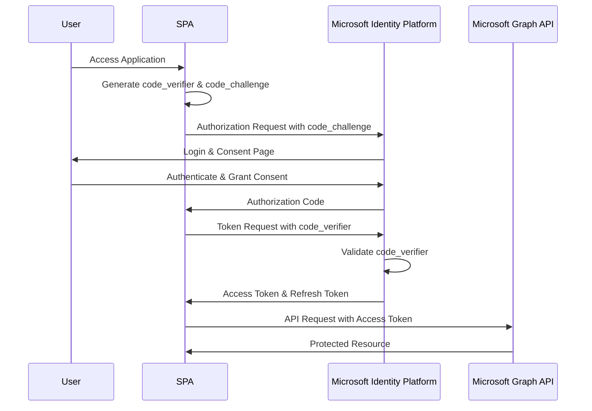
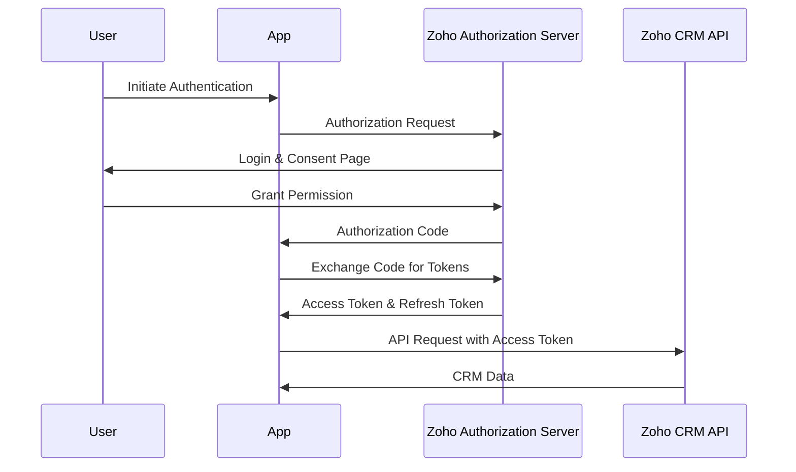
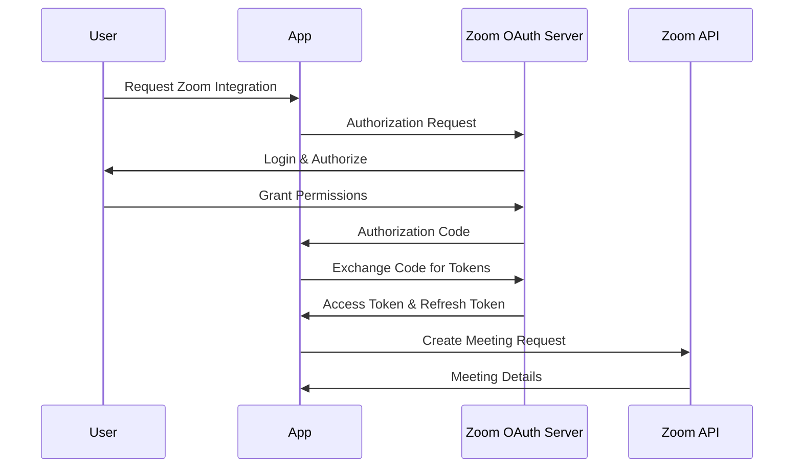
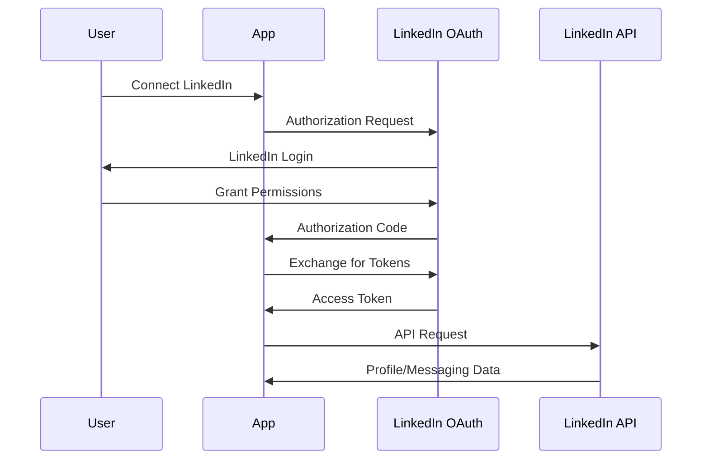

# EVA Assistant Integration Technical Specifications

## Table of Contents
1. [Microsoft Graph API (Entra ID) Integration](#1-microsoft-graph-api-entra-id-integration)
2. [Zoho CRM Integration](#2-zoho-crm-integration)
3. [Zoom Integration](#3-zoom-integration)
4. [LinkedIn Integration](#4-linkedin-integration)
5. [Twilio Integration](#5-twilio-integration)

---

## 1. Microsoft Graph API (Entra ID) Integration

### 1.1 OAuth 2.0 PKCE Flow Implementation for SPAs

#### Authentication Flow Diagram


#### Implementation Requirements

1. **Redirect URI Configuration**
   - Must be configured as type `spa` in Azure AD app registration
   - Supports CORS for auth code flow with PKCE
   - Example: `https://yourdomain.com/auth/callback`

2. **MSAL.js Implementation**
   ```javascript
   const msalConfig = {
     auth: {
       clientId: process.env.AZURE_CLIENT_ID,
       authority: `https://login.microsoftonline.com/${process.env.AZURE_TENANT_ID}`,
       redirectUri: process.env.REDIRECT_URI,
     },
     cache: {
       cacheLocation: "sessionStorage",
       storeAuthStateInCookie: false,
     }
   };
   
   const msalInstance = new PublicClientApplication(msalConfig);
   ```

### 1.2 Required Permissions (Scopes)

#### Email Permissions
- **Mail.Read** - Read user mail
- **Mail.ReadWrite** - Read and write user mail
- **Mail.Send** - Send mail as the user

#### Calendar Permissions
- **Calendars.Read** - Read user calendars
- **Calendars.ReadWrite** - Full access to user calendars
- **Calendars.Read.Shared** - Read calendars user has access to

#### Contacts Permissions
- **Contacts.Read** - Read user contacts
- **Contacts.ReadWrite** - Full access to user contacts

#### Teams Meetings Permissions
- **OnlineMeetings.ReadWrite** - Create and manage online meetings
- **TeamsTab.ReadWriteForChat** - Manage Teams tabs in chats

#### Common Permissions
- **User.Read** - Sign in and read user profile
- **User.ReadBasic.All** - Read all users' basic profiles
- **Directory.Read.All** - Read directory data

### 1.3 Token Management and Refresh Strategies

#### Token Lifecycle
- Access tokens: Valid for 1 hour
- Refresh tokens: Valid for 90 days (with sliding window)
- ID tokens: Valid for 1 hour

#### Refresh Strategy Implementation
```javascript
async function getAccessToken() {
  const accounts = msalInstance.getAllAccounts();
  if (accounts.length > 0) {
    const request = {
      scopes: ["Mail.Read", "Calendars.ReadWrite"],
      account: accounts[0]
    };
    
    try {
      // Try silent token acquisition
      const response = await msalInstance.acquireTokenSilent(request);
      return response.accessToken;
    } catch (error) {
      // Fall back to interactive
      if (error instanceof InteractionRequiredAuthError) {
        const response = await msalInstance.acquireTokenPopup(request);
        return response.accessToken;
      }
      throw error;
    }
  }
}
```

### 1.4 Rate Limiting Considerations

#### Current Limits (2024)
- Service-specific throttling applies
- Common throttling scenarios:
  - Outlook/Exchange: ~10,000 requests per 10 minutes per app per mailbox
  - Microsoft Teams: 1 request per second for POST messages
  - General limit: Varies by service and operation type

#### Best Practices to Avoid Throttling
1. **Use Delta Queries**
   ```http
   GET https://graph.microsoft.com/v1.0/me/messages/delta
   ```

2. **Implement Exponential Backoff**
   ```javascript
   async function makeRequestWithRetry(url, options, retries = 3) {
     for (let i = 0; i < retries; i++) {
       try {
         const response = await fetch(url, options);
         if (response.status === 429) {
           const retryAfter = response.headers.get('Retry-After') || Math.pow(2, i);
           await new Promise(resolve => setTimeout(resolve, retryAfter * 1000));
           continue;
         }
         return response;
       } catch (error) {
         if (i === retries - 1) throw error;
       }
     }
   }
   ```

3. **Use Batching**
   ```javascript
   const batchRequest = {
     requests: [
       { id: "1", method: "GET", url: "/me/messages?$top=10" },
       { id: "2", method: "GET", url: "/me/events?$top=10" },
       { id: "3", method: "GET", url: "/me/contacts?$top=10" }
     ]
   };
   ```

### 1.5 Environment Variables
```env
# Microsoft Graph API Configuration
AZURE_TENANT_ID=your-tenant-id
AZURE_CLIENT_ID=your-client-id
AZURE_CLIENT_SECRET=your-client-secret  # For server-side operations only
GRAPH_API_ENDPOINT=https://graph.microsoft.com/v1.0
REDIRECT_URI=https://yourdomain.com/auth/callback
```

### 1.6 API Endpoints to Implement

#### Email Endpoints
```typescript
// List messages
GET /me/messages

// Send email
POST /me/sendMail
{
  "message": {
    "subject": "Subject",
    "body": { "contentType": "HTML", "content": "Content" },
    "toRecipients": [{ "emailAddress": { "address": "email@example.com" } }]
  }
}

// Get message details
GET /me/messages/{id}
```

#### Calendar Endpoints
```typescript
// List events
GET /me/events

// Create event
POST /me/events
{
  "subject": "Meeting",
  "start": { "dateTime": "2024-01-10T10:00:00", "timeZone": "UTC" },
  "end": { "dateTime": "2024-01-10T11:00:00", "timeZone": "UTC" }
}

// Update event
PATCH /me/events/{id}
```

#### Teams Meeting Endpoints
```typescript
// Create online meeting
POST /me/onlineMeetings
{
  "startDateTime": "2024-01-10T10:00:00Z",
  "endDateTime": "2024-01-10T11:00:00Z",
  "subject": "Team Meeting"
}
```

### 1.7 Error Handling Strategies

```javascript
class GraphAPIError extends Error {
  constructor(response) {
    super(`Graph API Error: ${response.status}`);
    this.status = response.status;
    this.code = response.error?.code;
    this.details = response.error?.message;
  }
}

async function handleGraphAPIRequest(url, options) {
  try {
    const response = await fetch(url, options);
    
    if (!response.ok) {
      const errorData = await response.json();
      
      switch (response.status) {
        case 401:
          // Token expired or invalid
          await refreshToken();
          return handleGraphAPIRequest(url, options);
        case 403:
          // Insufficient permissions
          throw new GraphAPIError({ 
            status: 403, 
            error: { code: 'Forbidden', message: 'Insufficient permissions' }
          });
        case 429:
          // Rate limited
          const retryAfter = response.headers.get('Retry-After');
          await new Promise(resolve => setTimeout(resolve, retryAfter * 1000));
          return handleGraphAPIRequest(url, options);
        default:
          throw new GraphAPIError({ status: response.status, error: errorData });
      }
    }
    
    return response.json();
  } catch (error) {
    console.error('Graph API Request Failed:', error);
    throw error;
  }
}
```

### 1.8 Security Considerations

1. **Token Storage**
   - Store tokens in sessionStorage (not localStorage) for SPAs
   - Never expose tokens in URLs or logs
   - Implement token encryption at rest

2. **CORS Configuration**
   - Properly configure CORS for your SPA domain
   - Use specific origins, not wildcards

3. **Scope Management**
   - Request minimal required scopes
   - Implement incremental consent

4. **Secure Communication**
   - Always use HTTPS
   - Implement certificate pinning for mobile apps

---

## 2. Zoho CRM Integration

### 2.1 OAuth 2.0 Setup Requirements

#### Authentication Flow Diagram


#### Setup Steps

1. **Register Application**
   - Navigate to https://api-console.zoho.com
   - Click "ADD CLIENT"
   - Choose "Server-based Applications"
   - Configure redirect URI

2. **OAuth Configuration**
   ```javascript
   const zohoConfig = {
     clientId: process.env.ZOHO_CLIENT_ID,
     clientSecret: process.env.ZOHO_CLIENT_SECRET,
     redirectUri: process.env.ZOHO_REDIRECT_URI,
     scope: 'ZohoCRM.modules.ALL,ZohoCRM.settings.ALL,ZohoCRM.webhooks.ALL',
     accessType: 'offline',
     prompt: 'consent'
   };
   ```

### 2.2 API Scopes for Lead and Contact Management

#### Essential Scopes
- **ZohoCRM.modules.leads.ALL** - Full access to leads
- **ZohoCRM.modules.contacts.ALL** - Full access to contacts
- **ZohoCRM.modules.accounts.ALL** - Full access to accounts
- **ZohoCRM.modules.deals.ALL** - Full access to deals
- **ZohoCRM.settings.READ** - Read CRM settings
- **ZohoCRM.webhooks.ALL** - Manage webhooks
- **ZohoCRM.bulk.ALL** - Bulk operations

#### Scope Structure
```
Service.Module.Operation
```
- Service: ZohoCRM
- Module: leads, contacts, accounts, etc.
- Operation: READ, CREATE, UPDATE, DELETE, ALL

### 2.3 Webhook Configuration

#### Setting Up Webhooks
```javascript
const webhookConfig = {
  url: 'https://yourdomain.com/webhooks/zoho',
  events: [
    'Leads.create',
    'Leads.update',
    'Contacts.create',
    'Contacts.update',
    'Deals.create',
    'Deals.update'
  ]
};

// API call to register webhook
POST https://www.zohoapis.com/crm/v2/settings/webhooks
{
  "webhooks": [{
    "notify_url": "https://yourdomain.com/webhooks/zoho",
    "events": ["Leads.create", "Leads.update"],
    "token": "your-webhook-token"
  }]
}
```

#### Webhook Payload Structure
```json
{
  "module": "Leads",
  "operation": "create",
  "token": "your-webhook-token",
  "data": [{
    "id": "3652397000000734001",
    "Company": "Acme Corp",
    "Last_Name": "Smith",
    "First_Name": "John",
    "Email": "john.smith@acme.com"
  }]
}
```

### 2.4 Rate Limits and Best Practices

#### API Credit System
- Each API call consumes 1 credit
- Credits reset daily at 12:00 AM PST
- Credit allocation based on user licenses:
  - Free Edition: 1,000 credits/day
  - Standard: 50,000 credits/day/user
  - Professional: 50,000 credits/day/user
  - Enterprise: 100,000 credits/day/user

#### Best Practices
1. **Bulk Operations**
   ```javascript
   // Insert multiple records in one call
   POST /crm/v2/Leads
   {
     "data": [
       { "Last_Name": "Lead1", "Company": "Company1" },
       { "Last_Name": "Lead2", "Company": "Company2" }
       // Up to 100 records
     ]
   }
   ```

2. **Use Pagination**
   ```javascript
   GET /crm/v2/Leads?page=1&per_page=200
   ```

3. **Implement Caching**
   ```javascript
   const cache = new Map();
   
   async function getCRMData(module, id) {
     const cacheKey = `${module}:${id}`;
     if (cache.has(cacheKey)) {
       const cached = cache.get(cacheKey);
       if (Date.now() - cached.timestamp < 300000) { // 5 minutes
         return cached.data;
       }
     }
     
     const data = await fetchFromZoho(module, id);
     cache.set(cacheKey, { data, timestamp: Date.now() });
     return data;
   }
   ```

### 2.5 Environment Variables
```env
# Zoho CRM Configuration
ZOHO_CLIENT_ID=your-client-id
ZOHO_CLIENT_SECRET=your-client-secret
ZOHO_REDIRECT_URI=https://yourdomain.com/auth/zoho/callback
ZOHO_API_DOMAIN=https://www.zohoapis.com
ZOHO_ACCOUNTS_URL=https://accounts.zoho.com
ZOHO_WEBHOOK_TOKEN=your-webhook-verification-token
```

### 2.6 API Endpoints to Implement

#### Lead Management
```javascript
// Get all leads
GET /crm/v2/Leads

// Get specific lead
GET /crm/v2/Leads/{lead_id}

// Create lead
POST /crm/v2/Leads
{
  "data": [{
    "Company": "Acme Corp",
    "Last_Name": "Smith",
    "First_Name": "John",
    "Email": "john@acme.com",
    "Phone": "+1234567890"
  }]
}

// Update lead
PUT /crm/v2/Leads/{lead_id}

// Delete lead
DELETE /crm/v2/Leads/{lead_id}
```

#### Contact Management
```javascript
// Get all contacts
GET /crm/v2/Contacts

// Create contact
POST /crm/v2/Contacts
{
  "data": [{
    "Last_Name": "Doe",
    "First_Name": "Jane",
    "Email": "jane.doe@example.com",
    "Account_Name": "Example Corp"
  }]
}

// Convert lead to contact
POST /crm/v2/Leads/{lead_id}/actions/convert
{
  "data": [{
    "overwrite": true,
    "notify_lead_owner": true,
    "notify_new_entity_owner": true,
    "Accounts": "3652397000000734002",
    "Contacts": "3652397000000734003"
  }]
}
```

### 2.7 Error Handling
```javascript
class ZohoAPIError extends Error {
  constructor(response) {
    super(`Zoho API Error: ${response.code}`);
    this.code = response.code;
    this.message = response.message;
    this.details = response.details;
    this.status = response.status;
  }
}

async function handleZohoRequest(url, options) {
  try {
    const response = await fetch(url, {
      ...options,
      headers: {
        'Authorization': `Zoho-oauthtoken ${accessToken}`,
        'Content-Type': 'application/json',
        ...options.headers
      }
    });
    
    const data = await response.json();
    
    if (data.code && data.code !== 'SUCCESS') {
      switch (data.code) {
        case 'INVALID_TOKEN':
          // Refresh token and retry
          await refreshZohoToken();
          return handleZohoRequest(url, options);
        case 'RATE_LIMIT_EXCEEDED':
          // Implement backoff
          await new Promise(resolve => setTimeout(resolve, 60000));
          return handleZohoRequest(url, options);
        default:
          throw new ZohoAPIError(data);
      }
    }
    
    return data;
  } catch (error) {
    console.error('Zoho API Request Failed:', error);
    throw error;
  }
}
```

### 2.8 Security Considerations

1. **Token Storage**
   - Store refresh tokens securely (encrypted)
   - Access tokens in memory only
   - Implement token rotation

2. **Webhook Security**
   - Verify webhook token in all requests
   - Use HTTPS endpoints only
   - Implement request signing

3. **Data Privacy**
   - Implement field-level security
   - Respect GDPR/privacy settings
   - Log access appropriately

---

## 3. Zoom Integration

### 3.1 OAuth Setup for Meeting Creation

#### Authentication Flow Diagram


#### OAuth App Types

1. **Server-to-Server OAuth (S2S)**
   - For backend integrations
   - No user interaction required
   - Account-level permissions

2. **User-Level OAuth**
   - Requires user consent
   - Acts on behalf of users
   - User-specific permissions

#### Configuration
```javascript
// Server-to-Server OAuth
const zoomS2SConfig = {
  accountId: process.env.ZOOM_ACCOUNT_ID,
  clientId: process.env.ZOOM_S2S_CLIENT_ID,
  clientSecret: process.env.ZOOM_S2S_CLIENT_SECRET
};

// User-Level OAuth
const zoomOAuthConfig = {
  clientId: process.env.ZOOM_CLIENT_ID,
  clientSecret: process.env.ZOOM_CLIENT_SECRET,
  redirectUri: process.env.ZOOM_REDIRECT_URI,
  authorizeUrl: 'https://zoom.us/oauth/authorize',
  tokenUrl: 'https://zoom.us/oauth/token'
};
```

### 3.2 Required Scopes for Meeting Management

#### Essential Scopes
- **meeting:write** - Create meetings for the user
- **meeting:write:admin** - Create meetings for any user (admin)
- **meeting:read** - View meeting details
- **meeting:read:admin** - View any user's meetings (admin)
- **user:read** - Read user information
- **recording:read** - Access meeting recordings
- **recording:write** - Manage meeting recordings

#### Scope Selection
```javascript
const requiredScopes = [
  'meeting:write',
  'meeting:read',
  'user:read',
  'recording:read'
].join(' ');

const authorizationUrl = `https://zoom.us/oauth/authorize?response_type=code&client_id=${clientId}&redirect_uri=${redirectUri}&scope=${requiredScopes}`;
```

### 3.3 Webhook Events for Meeting Status Updates

#### Webhook Configuration
```javascript
// Register webhook endpoint
const webhookConfig = {
  url: 'https://yourdomain.com/webhooks/zoom',
  auth_user: 'webhook_auth_user',
  auth_password: 'webhook_auth_password',
  events: [
    'meeting.started',
    'meeting.ended',
    'meeting.participant_joined',
    'meeting.participant_left',
    'meeting.created',
    'meeting.updated',
    'meeting.deleted',
    'recording.completed'
  ]
};
```

#### Webhook Event Payload
```json
{
  "event": "meeting.started",
  "payload": {
    "account_id": "abc123",
    "object": {
      "id": "12345678",
      "uuid": "abcdefg12345",
      "host_id": "xyz789",
      "topic": "Team Standup",
      "type": 2,
      "start_time": "2024-01-10T10:00:00Z",
      "duration": 30,
      "timezone": "UTC"
    }
  },
  "event_ts": 1704883200000
}
```

#### Webhook Verification
```javascript
function verifyZoomWebhook(request) {
  const message = `v0:${request.headers['x-zm-request-timestamp']}:${JSON.stringify(request.body)}`;
  const hashForVerify = crypto
    .createHmac('sha256', process.env.ZOOM_WEBHOOK_SECRET)
    .update(message)
    .digest('hex');
  
  const signature = `v0=${hashForVerify}`;
  return signature === request.headers['x-zm-signature'];
}
```

### 3.4 Environment Variables
```env
# Zoom Configuration
ZOOM_ACCOUNT_ID=your-account-id
ZOOM_CLIENT_ID=your-client-id
ZOOM_CLIENT_SECRET=your-client-secret
ZOOM_S2S_CLIENT_ID=your-s2s-client-id
ZOOM_S2S_CLIENT_SECRET=your-s2s-client-secret
ZOOM_REDIRECT_URI=https://yourdomain.com/auth/zoom/callback
ZOOM_WEBHOOK_SECRET=your-webhook-secret
ZOOM_API_BASE_URL=https://api.zoom.us/v2
```

### 3.5 API Endpoints to Implement

#### Meeting Management
```javascript
// Create a meeting
POST /users/{userId}/meetings
{
  "topic": "Team Meeting",
  "type": 2, // Scheduled meeting
  "start_time": "2024-01-10T10:00:00Z",
  "duration": 30,
  "timezone": "UTC",
  "password": "123456",
  "agenda": "Weekly team sync",
  "settings": {
    "host_video": true,
    "participant_video": true,
    "join_before_host": false,
    "mute_upon_entry": true,
    "watermark": false,
    "use_pmi": false,
    "approval_type": 0,
    "audio": "both",
    "auto_recording": "cloud"
  }
}

// Get meeting details
GET /meetings/{meetingId}

// Update meeting
PATCH /meetings/{meetingId}

// Delete meeting
DELETE /meetings/{meetingId}

// List meetings
GET /users/{userId}/meetings
```

#### Meeting Participants
```javascript
// Get participants
GET /meetings/{meetingId}/participants

// Get past meeting participants
GET /past_meetings/{meetingId}/participants
```

### 3.6 Error Handling
```javascript
class ZoomAPIError extends Error {
  constructor(response) {
    super(`Zoom API Error: ${response.code}`);
    this.code = response.code;
    this.message = response.message;
  }
}

async function handleZoomRequest(url, options) {
  try {
    const response = await fetch(url, {
      ...options,
      headers: {
        'Authorization': `Bearer ${accessToken}`,
        'Content-Type': 'application/json',
        ...options.headers
      }
    });
    
    if (!response.ok) {
      const error = await response.json();
      
      switch (response.status) {
        case 401:
          // Token expired
          await refreshZoomToken();
          return handleZoomRequest(url, options);
        case 429:
          // Rate limited
          const retryAfter = response.headers.get('X-RateLimit-Reset');
          await new Promise(resolve => 
            setTimeout(resolve, (retryAfter - Date.now() / 1000) * 1000)
          );
          return handleZoomRequest(url, options);
        default:
          throw new ZoomAPIError(error);
      }
    }
    
    return response.json();
  } catch (error) {
    console.error('Zoom API Request Failed:', error);
    throw error;
  }
}
```

### 3.7 Security Considerations

1. **Token Management**
   - Implement token refresh before expiry
   - Store tokens securely
   - Use S2S OAuth for server operations

2. **Meeting Security**
   - Enable waiting rooms by default
   - Require meeting passwords
   - Implement host key validation

3. **Webhook Security**
   - Validate webhook signatures
   - Use HTTPS endpoints
   - Implement replay attack prevention

---

## 4. LinkedIn Integration

### 4.1 OAuth 2.0 for Profile Access and Messaging

#### Authentication Flow Diagram


#### OAuth Configuration
```javascript
const linkedInConfig = {
  clientId: process.env.LINKEDIN_CLIENT_ID,
  clientSecret: process.env.LINKEDIN_CLIENT_SECRET,
  redirectUri: process.env.LINKEDIN_REDIRECT_URI,
  scope: 'r_liteprofile r_emailaddress w_member_social',
  state: generateRandomState(),
  authorizationUrl: 'https://www.linkedin.com/oauth/v2/authorization',
  tokenUrl: 'https://www.linkedin.com/oauth/v2/accessToken'
};
```

### 4.2 API Limitations and Rate Limits

#### Rate Limiting Structure
- Daily request limits per application
- Throttling returns 429 status code
- Limits vary by endpoint and API product
- No public documentation of exact limits

#### Common Limitations
1. **Profile Access**
   - Basic profile only without partnership
   - Limited fields available
   - No access to full profile without approval

2. **Messaging**
   - Sponsored messaging requires approval
   - Direct messaging API restricted
   - InMail capabilities limited

3. **Search**
   - People search requires partnership
   - Limited to basic company search

### 4.3 Best Practices for Recruiter Workflows

#### Available Scopes
```javascript
// Open Permissions (No approval needed)
const openScopes = [
  'r_liteprofile',     // Basic profile
  'r_emailaddress',    // Email address
  'w_member_social'    // Share content
];

// Partner Program Scopes (Approval required)
const partnerScopes = [
  'r_fullprofile',     // Full profile access
  'r_1st_connections', // First-degree connections
  'w_messages',        // Send messages
  'r_recruiter_profile' // Recruiter-specific data
];
```

#### Recruiter Integration Approach
```javascript
// Profile enrichment workflow
async function enrichCandidateProfile(linkedInId) {
  try {
    // Get basic profile
    const profile = await getLinkedInProfile(linkedInId);
    
    // Extract available data
    const candidateData = {
      firstName: profile.localizedFirstName,
      lastName: profile.localizedLastName,
      headline: profile.localizedHeadline,
      profilePicture: profile.profilePicture?.displayImage,
      linkedInUrl: `https://linkedin.com/in/${profile.vanityName}`
    };
    
    // Get email if permitted
    const email = await getLinkedInEmail(linkedInId);
    if (email) {
      candidateData.email = email.elements[0]['handle~'].emailAddress;
    }
    
    return candidateData;
  } catch (error) {
    console.error('Profile enrichment failed:', error);
    throw error;
  }
}
```

### 4.4 Environment Variables
```env
# LinkedIn Configuration
LINKEDIN_CLIENT_ID=your-client-id
LINKEDIN_CLIENT_SECRET=your-client-secret
LINKEDIN_REDIRECT_URI=https://yourdomain.com/auth/linkedin/callback
LINKEDIN_API_BASE_URL=https://api.linkedin.com/v2
```

### 4.5 API Endpoints to Implement

#### Profile Access
```javascript
// Get authenticated user's profile
GET https://api.linkedin.com/v2/me
Headers: {
  'Authorization': 'Bearer {access_token}',
  'cache-control': 'no-cache',
  'X-Restli-Protocol-Version': '2.0.0'
}

// Get email address
GET https://api.linkedin.com/v2/emailAddress?q=members&projection=(elements*(handle~))

// Get profile picture
GET https://api.linkedin.com/v2/me?projection=(profilePicture(displayImage~:playableStreams))
```

#### Content Sharing (Recruiter Posts)
```javascript
// Share content
POST https://api.linkedin.com/v2/ugcPosts
{
  "author": "urn:li:person:{personId}",
  "lifecycleState": "PUBLISHED",
  "specificContent": {
    "com.linkedin.ugc.ShareContent": {
      "shareCommentary": {
        "text": "We're hiring! Check out this position..."
      },
      "shareMediaCategory": "ARTICLE",
      "media": [{
        "status": "READY",
        "originalUrl": "https://yourcompany.com/job-posting"
      }]
    }
  },
  "visibility": {
    "com.linkedin.ugc.MemberNetworkVisibility": "PUBLIC"
  }
}
```

### 4.6 Error Handling
```javascript
class LinkedInAPIError extends Error {
  constructor(response) {
    super(`LinkedIn API Error: ${response.status}`);
    this.status = response.status;
    this.message = response.message;
    this.serviceErrorCode = response.serviceErrorCode;
  }
}

async function handleLinkedInRequest(url, options) {
  try {
    const response = await fetch(url, {
      ...options,
      headers: {
        'Authorization': `Bearer ${accessToken}`,
        'X-Restli-Protocol-Version': '2.0.0',
        'Content-Type': 'application/json',
        ...options.headers
      }
    });
    
    if (!response.ok) {
      const error = await response.json();
      
      switch (response.status) {
        case 401:
          throw new LinkedInAPIError({
            status: 401,
            message: 'Invalid or expired access token'
          });
        case 403:
          throw new LinkedInAPIError({
            status: 403,
            message: 'Insufficient permissions'
          });
        case 429:
          throw new LinkedInAPIError({
            status: 429,
            message: 'Rate limit exceeded'
          });
        default:
          throw new LinkedInAPIError(error);
      }
    }
    
    return response.json();
  } catch (error) {
    console.error('LinkedIn API Request Failed:', error);
    throw error;
  }
}
```

### 4.7 Security Considerations

1. **Token Security**
   - LinkedIn tokens don't expire (until revoked)
   - Store securely and encrypt at rest
   - Implement token revocation on logout

2. **Data Privacy**
   - Respect member privacy settings
   - Implement data retention policies
   - Follow LinkedIn's API Terms of Use

3. **Rate Limit Management**
   - Implement request queuing
   - Cache responses appropriately
   - Monitor usage patterns

---

## 5. Twilio Integration

### 5.1 Account SID and Auth Token Setup

#### Authentication Methods

1. **Account SID + Auth Token (Basic)**
   ```javascript
   const twilioClient = require('twilio')(
     process.env.TWILIO_ACCOUNT_SID,
     process.env.TWILIO_AUTH_TOKEN
   );
   ```

2. **API Keys (Recommended for Production)**
   ```javascript
   const twilioClient = require('twilio')(
     process.env.TWILIO_API_KEY_SID,
     process.env.TWILIO_API_KEY_SECRET,
     { accountSid: process.env.TWILIO_ACCOUNT_SID }
   );
   ```

#### Security Setup
```javascript
// Generate API Key programmatically
const apiKey = await twilioClient.newKeys.create({
  friendlyName: 'EVA Assistant Production Key'
});

console.log('API Key SID:', apiKey.sid);
console.log('API Key Secret:', apiKey.secret); // Save this securely!
```

### 5.2 Phone Number Provisioning

#### Search and Purchase Numbers
```javascript
// Search for available numbers
const availableNumbers = await twilioClient.availablePhoneNumbers('US')
  .local
  .list({
    areaCode: 415,
    capabilities: {
      voice: true,
      sms: true,
      mms: true
    },
    limit: 10
  });

// Purchase a number
const purchasedNumber = await twilioClient.incomingPhoneNumbers.create({
  phoneNumber: availableNumbers[0].phoneNumber,
  friendlyName: 'EVA Assistant Main Line',
  smsUrl: 'https://yourdomain.com/webhooks/twilio/sms',
  smsMethod: 'POST',
  voiceUrl: 'https://yourdomain.com/webhooks/twilio/voice',
  voiceMethod: 'POST'
});
```

### 5.3 SMS and Voice Call Implementation

#### SMS Implementation
```javascript
// Send SMS
async function sendSMS(to, body) {
  try {
    const message = await twilioClient.messages.create({
      body: body,
      from: process.env.TWILIO_PHONE_NUMBER,
      to: to,
      statusCallback: 'https://yourdomain.com/webhooks/twilio/status'
    });
    
    return {
      sid: message.sid,
      status: message.status,
      dateCreated: message.dateCreated
    };
  } catch (error) {
    console.error('SMS Send Error:', error);
    throw error;
  }
}

// Send SMS with media (MMS)
async function sendMMS(to, body, mediaUrl) {
  const message = await twilioClient.messages.create({
    body: body,
    from: process.env.TWILIO_PHONE_NUMBER,
    to: to,
    mediaUrl: [mediaUrl]
  });
  
  return message;
}
```

#### Voice Call Implementation
```javascript
// Make outbound call
async function makeCall(to, twimlUrl) {
  try {
    const call = await twilioClient.calls.create({
      to: to,
      from: process.env.TWILIO_PHONE_NUMBER,
      url: twimlUrl || 'https://yourdomain.com/webhooks/twilio/voice/outbound',
      statusCallback: 'https://yourdomain.com/webhooks/twilio/voice/status',
      statusCallbackEvent: ['initiated', 'ringing', 'answered', 'completed'],
      record: true,
      recordingStatusCallback: 'https://yourdomain.com/webhooks/twilio/recording'
    });
    
    return {
      sid: call.sid,
      status: call.status,
      direction: call.direction
    };
  } catch (error) {
    console.error('Call Error:', error);
    throw error;
  }
}

// TwiML for voice response
function generateVoiceTwiML(message) {
  const twiml = new twilio.twiml.VoiceResponse();
  twiml.say({
    voice: 'alice',
    language: 'en-US'
  }, message);
  
  // Gather input
  const gather = twiml.gather({
    numDigits: 1,
    action: '/webhooks/twilio/voice/gather',
    method: 'POST'
  });
  
  gather.say('Press 1 to speak with a representative. Press 2 to leave a message.');
  
  // If no input, hang up
  twiml.say('We didn\'t receive any input. Goodbye!');
  twiml.hangup();
  
  return twiml.toString();
}
```

### 5.4 Webhook Configuration for Inbound Messages

#### SMS Webhook Handler
```javascript
app.post('/webhooks/twilio/sms', (req, res) => {
  const twiml = new twilio.twiml.MessagingResponse();
  
  // Validate webhook signature
  const signature = req.headers['x-twilio-signature'];
  const url = `https://${req.headers.host}${req.url}`;
  
  if (!twilio.validateRequest(
    process.env.TWILIO_AUTH_TOKEN,
    signature,
    url,
    req.body
  )) {
    return res.status(403).send('Forbidden');
  }
  
  // Process incoming message
  const incomingMessage = {
    from: req.body.From,
    to: req.body.To,
    body: req.body.Body,
    messageSid: req.body.MessageSid,
    numMedia: parseInt(req.body.NumMedia || 0)
  };
  
  // Handle media if present
  if (incomingMessage.numMedia > 0) {
    for (let i = 0; i < incomingMessage.numMedia; i++) {
      incomingMessage[`mediaUrl${i}`] = req.body[`MediaUrl${i}`];
      incomingMessage[`mediaType${i}`] = req.body[`MediaContentType${i}`];
    }
  }
  
  // Process message and respond
  processIncomingSMS(incomingMessage)
    .then(responseText => {
      twiml.message(responseText);
      res.type('text/xml').send(twiml.toString());
    })
    .catch(error => {
      console.error('SMS Processing Error:', error);
      twiml.message('Sorry, we couldn\'t process your message. Please try again.');
      res.type('text/xml').send(twiml.toString());
    });
});
```

#### Voice Webhook Handler
```javascript
app.post('/webhooks/twilio/voice', (req, res) => {
  const twiml = new twilio.twiml.VoiceResponse();
  
  // Validate webhook
  if (!validateTwilioWebhook(req)) {
    return res.status(403).send('Forbidden');
  }
  
  const callData = {
    from: req.body.From,
    to: req.body.To,
    callSid: req.body.CallSid,
    callStatus: req.body.CallStatus,
    direction: req.body.Direction
  };
  
  // Handle based on call direction
  if (callData.direction === 'inbound') {
    // Welcome message
    twiml.say('Welcome to EVA Assistant.');
    
    // Record the call
    twiml.record({
      action: '/webhooks/twilio/voice/recording',
      method: 'POST',
      maxLength: 120,
      transcribe: true,
      transcribeCallback: '/webhooks/twilio/voice/transcription'
    });
  }
  
  res.type('text/xml').send(twiml.toString());
});
```

#### Webhook Security Validation
```javascript
function validateTwilioWebhook(req) {
  const authToken = process.env.TWILIO_AUTH_TOKEN;
  const signature = req.headers['x-twilio-signature'];
  const url = `https://${req.headers.host}${req.originalUrl}`;
  
  // Create parameter string
  const params = req.body;
  const paramString = Object.keys(params)
    .sort()
    .map(key => key + params[key])
    .join('');
  
  // Calculate expected signature
  const expectedSignature = crypto
    .createHmac('sha1', authToken)
    .update(url + paramString)
    .digest('base64');
  
  return signature === expectedSignature;
}
```

### 5.5 Environment Variables
```env
# Twilio Configuration
TWILIO_ACCOUNT_SID=your-account-sid
TWILIO_AUTH_TOKEN=your-auth-token
TWILIO_API_KEY_SID=your-api-key-sid
TWILIO_API_KEY_SECRET=your-api-key-secret
TWILIO_PHONE_NUMBER=+1234567890
TWILIO_WEBHOOK_BASE_URL=https://yourdomain.com/webhooks/twilio
```

### 5.6 Advanced Features

#### Conversation Tracking
```javascript
class ConversationManager {
  constructor() {
    this.conversations = new Map();
  }
  
  async handleMessage(from, to, body) {
    const conversationKey = this.getConversationKey(from, to);
    
    if (!this.conversations.has(conversationKey)) {
      this.conversations.set(conversationKey, {
        participants: [from, to],
        messages: [],
        startTime: new Date(),
        context: {}
      });
    }
    
    const conversation = this.conversations.get(conversationKey);
    conversation.messages.push({
      from,
      to,
      body,
      timestamp: new Date()
    });
    
    // Process with context
    return this.processWithContext(conversation, body);
  }
  
  getConversationKey(from, to) {
    return [from, to].sort().join(':');
  }
}
```

#### Call Recording Management
```javascript
// Handle recording completion
app.post('/webhooks/twilio/recording', async (req, res) => {
  const recordingData = {
    recordingSid: req.body.RecordingSid,
    recordingUrl: req.body.RecordingUrl,
    recordingDuration: req.body.RecordingDuration,
    callSid: req.body.CallSid
  };
  
  // Download and store recording
  const recordingMp3 = `${recordingData.recordingUrl}.mp3`;
  
  try {
    // Store in your system
    await storeRecording(recordingData);
    
    // Delete from Twilio after storing (optional)
    await twilioClient.recordings(recordingData.recordingSid).remove();
    
    res.status(200).send('OK');
  } catch (error) {
    console.error('Recording processing error:', error);
    res.status(500).send('Error');
  }
});
```

### 5.7 Error Handling
```javascript
class TwilioError extends Error {
  constructor(twilioError) {
    super(twilioError.message);
    this.code = twilioError.code;
    this.moreInfo = twilioError.moreInfo;
    this.status = twilioError.status;
  }
}

async function handleTwilioOperation(operation) {
  try {
    return await operation();
  } catch (error) {
    if (error.code) {
      // Twilio-specific error
      switch (error.code) {
        case 20003:
          throw new TwilioError({
            ...error,
            message: 'Authentication failed - check credentials'
          });
        case 21211:
          throw new TwilioError({
            ...error,
            message: 'Invalid phone number format'
          });
        case 21608:
          throw new TwilioError({
            ...error,
            message: 'The number is unverified. Verify your Twilio phone number.'
          });
        default:
          throw new TwilioError(error);
      }
    }
    throw error;
  }
}
```

### 5.8 Security Considerations

1. **Credential Security**
   - Never commit credentials to version control
   - Use environment variables
   - Rotate API keys regularly
   - Use API keys instead of Auth Token in production

2. **Webhook Security**
   - Always validate webhook signatures
   - Use HTTPS endpoints only
   - Implement request replay protection
   - Log all webhook activity

3. **Data Privacy**
   - Implement message retention policies
   - Encrypt stored recordings
   - Comply with telecommunication regulations
   - Implement opt-out mechanisms

4. **Rate Limiting**
   - Implement queue for bulk operations
   - Respect Twilio's rate limits
   - Use status callbacks for async operations
   - Monitor usage and costs

---

## General Security Considerations for All Integrations

### 1. Token Storage
- Use secure key management services (AWS KMS, Azure Key Vault)
- Encrypt tokens at rest
- Implement token rotation
- Never expose tokens in client-side code

### 2. API Request Security
- Always use HTTPS
- Implement request signing where available
- Add request timeouts
- Log all API activity for audit trails

### 3. Error Handling
- Never expose sensitive information in error messages
- Implement proper logging for debugging
- Use correlation IDs for request tracking
- Have fallback mechanisms for service outages

### 4. Data Privacy
- Implement data minimization
- Follow GDPR/CCPA requirements
- Have clear data retention policies
- Allow users to export/delete their data

### 5. Monitoring and Alerting
- Monitor API usage and rate limits
- Set up alerts for authentication failures
- Track webhook delivery success rates
- Implement health checks for all integrations