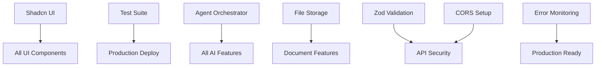

# EVA Platform Master TODO List

> **Last Updated**: 2025-07-15  
> **Total Tasks**: 54  
> **Completion Status**: 22/25 features complete (88%)  
> **Last Session**: 2025-07-15

## 🔄 Recent Progress
- ✅ **Zoom Integration Backend** - API endpoints created with GET/POST support
- ✅ **OWASP Security Headers** - Implemented for Zoom integration
- ✅ **LinkedIn Icon Fix** - Resolved lucide-react import issue
- ✅ **Microsoft OAuth Cleanup** - Removed Supabase OAuth callbacks, using standalone PKCE
- 🚧 **Zoom UI Components** - Backend ready, UI pending

## 📊 Priority Matrix

### P0 - Critical Blockers (Must Fix Immediately)
- 🚨 **Agent Orchestrator Backend** - Blocking all AI automation
- 🚨 **Test Infrastructure** - Blocking production deployment
- 🚨 **File Storage Setup** - Blocking document management

### P1 - High Priority (Revenue Enablers)
- 💰 Zoom Integration UI Components & Testing
- 💰 Twilio UI (Voice/SMS)
- 💰 AI Interview Center API Routes (+ Zoom integration)
- 💰 Resume Parser API Routes
- 💰 Candidates CRUD Operations
- 💰 Messages Unified UI
- 💰 Task Management Backend Connection
- 💰 Analytics Real Event Tracking

### P2 - Medium Priority (Efficiency Enhancers)
- ⚡ Microsoft Teams UI
- ⚡ Competitor Analysis Backend
- ⚡ Outreach Campaigns Database
- ⚡ Email Templates Rich Editor

### P3 - Low Priority (Nice to Have)
- ✨ AI Image Generation
- ✨ SharePoint Version History
- ✨ Post Predictor Real-time Trends
- ✨ Advanced Data Visualizations

## 🗓️ Development Roadmap

### Phase 1: Foundation (Week 1)
1. **Shadcn UI Installation** (2h)
2. **Test Suite Setup** (2d)
3. **CORS Configuration** (4h)
4. **Zod Schema Validation** (1d)
5. **Error Monitoring Setup** (4h)

### Phase 2: Core Features (Week 2)
1. **Zoom Integration UI & Testing** (2d)
2. **Agent Orchestrator Backend** (3d)
3. **File Storage Buckets** (1d)
4. **Twilio Frontend UI** (3d)

### Phase 3: Enhanced Productivity (Week 3)
1. **Messages UI & WebSocket** (2d)
2. **AI Interview Center Routes** (1d)
3. **Resume Parser Routes** (1d)
4. **Candidates Management** (2d)
5. **Task Management Connection** (1d)

### Phase 4: AI Enhancements (Week 4)
1. **Analytics Event Tracking** (2d)
2. **Competitor Analysis Agent** (2d)
3. **Outreach Campaigns Database** (1d)
4. **LinkedIn UI Completion** (2d)

### Phase 5: Polish & Optimization (Week 5)
1. **Email Templates Editor** (1d)
2. **Virtual Scrolling** (1d)
3. **Real ML Models** (2d)
4. **Performance Optimization** (1d)
5. **Documentation** (1d)

## 📝 Detailed Task Breakdown

### 🔴 P0: Critical Infrastructure

#### 1. Agent Orchestrator Backend Edge Function
**Status**: Mock data only  
**Time Estimate**: 3 days  
**Files**: `supabase/functions/agent-orchestrator/`

- [ ] Create Edge Function handler
- [ ] Implement agent routing logic
- [ ] Add real-time progress updates
- [ ] Connect to UI WebSocket
- [ ] Implement error handling
- [ ] Add logging and monitoring

**Dependencies**: None  
**Blocked By**: Nothing  
**Blocks**: All AI automation features

#### 2. Comprehensive Test Suite
**Status**: No tests exist  
**Time Estimate**: 2 days  
**Files**: `frontend/__tests__/`, `frontend/jest.config.js`

- [ ] Configure Jest and React Testing Library
- [ ] Write unit tests for critical services
- [ ] Add E2E tests with Playwright
- [ ] Setup MSW for API mocking
- [ ] Achieve 80% coverage minimum
- [ ] Add pre-commit hooks

**Technical Notes**:
```bash
npm install --save-dev jest @testing-library/react @testing-library/jest-dom playwright msw
```

#### 3. File Storage System
**Status**: No buckets created  
**Time Estimate**: 1 day  
**Files**: `frontend/src/lib/supabase/storage.ts`

- [ ] Create Supabase storage buckets
- [ ] Implement upload service
- [ ] Add file type validation
- [ ] Setup access policies
- [ ] Create download endpoints
- [ ] Add progress tracking

### 🟡 P1: Revenue-Enabling Features

#### 4. Zoom Integration Completion
**Status**: Backend implemented, needs UI and testing  
**Time Estimate**: 2 days  
**Files**: `frontend/src/app/dashboard/interview-center/`, `frontend/src/app/api/zoom/`

- [ ] Create Zoom meeting UI components
- [ ] Test Zoom OAuth flow with real account
- [ ] Implement webhook handlers for meeting events
- [ ] Add meeting creation/update to Interview Center
- [ ] Test GET/POST endpoints with Zoom's interface
- [ ] Add meeting recording management

**Technical Notes**:
- API endpoints ready at `/api/zoom/meetings` and `/api/zoom/meetings/get/`
- Using `validateZoomApiKey` middleware for security
- Meeting IDs stored in `interviews` table

#### 5. Twilio Complete Frontend UI
**Status**: Backend ready, no UI  
**Time Estimate**: 3 days  
**Files**: `frontend/src/app/dashboard/calls/`

- [ ] Phone number management UI
- [ ] Call initiation interface
- [ ] SMS sending/receiving UI
- [ ] Call logs and recordings
- [ ] IVR flow builder
- [ ] Conference call controls

#### 6. AI Interview Center API Routes
**Status**: Agent ready, no routes  
**Time Estimate**: 1 day  
**Files**: `frontend/src/app/api/interview/`

- [ ] `/api/interview/schedule` - POST (integrate with Zoom)
- [ ] `/api/interview/questions` - GET/POST
- [ ] `/api/interview/feedback` - POST
- [ ] `/api/interview/analytics` - GET
- [ ] Connect to existing agent
- [ ] Add email notifications with Zoom links

#### 7. Resume Parser Implementation
**Status**: Agent ready, no routes  
**Time Estimate**: 1 day  
**Files**: `frontend/src/app/api/resume/`

- [ ] `/api/resume/parse` - POST
- [ ] `/api/resume/analyze` - POST
- [ ] `/api/resume/match` - POST
- [ ] PDF parsing with pdf-parse
- [ ] Connect to pipeline agent
- [ ] Add progress webhooks

#### 8. Candidates CRUD Operations
**Status**: UI shell only  
**Time Estimate**: 2 days  
**Files**: `frontend/src/app/dashboard/candidates/`

- [ ] Create candidate form
- [ ] Edit candidate modal
- [ ] Delete confirmation
- [ ] Bulk operations UI
- [ ] Search and filters
- [ ] Resume parser integration

#### 9. Unified Messages Interface
**Status**: Backend ready, no UI  
**Time Estimate**: 2 days  
**Files**: `frontend/src/app/dashboard/messages/`

- [ ] Conversation thread UI
- [ ] Multi-channel switcher
- [ ] Real-time WebSocket integration
- [ ] Message composer
- [ ] Attachment handling
- [ ] Read receipts

#### 10. Task Management Backend Connection
**Status**: UI shows mock data  
**Time Estimate**: 1 day  
**Files**: `frontend/src/app/dashboard/tasks/`

- [ ] Connect to Supabase tables
- [ ] Implement real-time updates
- [ ] Add AI prioritization calls
- [ ] Fix drag-and-drop sync
- [ ] Add bulk operations
- [ ] Enable notifications

#### 11. Analytics Event Tracking
**Status**: No real tracking  
**Time Estimate**: 2 days  
**Files**: `frontend/src/lib/analytics/`

- [ ] Implement PostHog/Mixpanel
- [ ] Add custom event tracking
- [ ] Create data pipeline
- [ ] Build aggregation jobs
- [ ] Add export functionality
- [ ] Create dashboards

### 🟢 P2: Productivity Enhancers

#### 12. Microsoft Teams UI
**Status**: Backend ready, no UI  
**Time Estimate**: 2 days  
**Files**: `frontend/src/app/dashboard/teams/`

- [ ] Channel browser UI
- [ ] Message posting interface
- [ ] File sharing components
- [ ] Meeting scheduler
- [ ] Notifications panel
- [ ] User presence indicators

#### 13. Competitor Analysis Backend
**Status**: Frontend ready, no backend  
**Time Estimate**: 2 days  
**Files**: `supabase/migrations/`

- [ ] Create competitor_analysis tables
- [ ] Add tracking_metrics table
- [ ] Implement SWOT storage
- [ ] Create materialized views
- [ ] Add indexes
- [ ] Setup RLS policies

#### 14. Outreach Campaigns Database
**Status**: Agent ready, no storage  
**Time Estimate**: 1 day  
**Files**: `supabase/migrations/`

- [ ] Create campaigns table
- [ ] Add recipients table
- [ ] Create templates table
- [ ] Add analytics tables
- [ ] Setup relationships
- [ ] Add API routes

#### 15. Email Templates Rich Editor
**Status**: Basic textarea only  
**Time Estimate**: 1 day  
**Files**: `frontend/src/components/email/`

- [ ] Integrate TipTap/Quill
- [ ] Add variable insertion
- [ ] Create preview mode
- [ ] Add template gallery
- [ ] Implement autosave
- [ ] Add version history

### 🔵 P3: Enhancement Features

#### 16. AI Image Generation
**Status**: Not started  
**Time Estimate**: 2 days  
**Files**: `frontend/src/lib/ai/image-generation.ts`

- [ ] Integrate DALL-E/Stable Diffusion
- [ ] Create generation UI
- [ ] Add style presets
- [ ] Implement gallery
- [ ] Add editing tools
- [ ] Create templates

#### 17. Post Predictor Enhancements
**Status**: Basic implementation  
**Time Estimate**: 2 days  
**Files**: `frontend/src/lib/services/post-predictor.ts`

- [ ] Add trend data API
- [ ] Create historical analysis
- [ ] Build ML pipeline
- [ ] Add A/B testing
- [ ] Create reports
- [ ] Add scheduling

### 🔧 Code-Level TODOs

#### Security & Validation (High Priority)
1. **User ID Validation** - All agents need user_id parameter
2. **Zod Schemas** - Input validation for all API routes
3. **CORS Configuration** - Production domains only
4. **Token Encryption** - Secure OAuth token storage

#### Performance (Medium Priority)
5. **Virtual Scrolling** - Large list optimization
6. **Lazy Loading** - Dynamic imports for code splitting
7. **Query Caching** - TanStack Query optimization
8. **WebSocket Management** - Connection pooling

#### Infrastructure (High Priority)
9. **Error Monitoring** - Sentry/LogRocket setup
10. **API Rate Limiting** - Protect endpoints
11. **Webhook Endpoints** - Twilio callbacks
12. **Background Jobs** - Queue implementation

## 📊 Dependencies Visualization



## 🚨 Risk Analysis

### High Risk
1. **Agent Orchestrator Complexity** - Complex state management
   - *Mitigation*: Start with single agent, scale gradually
2. **Test Coverage Gap** - 0% current coverage
   - *Mitigation*: Focus on critical paths first

### Medium Risk
3. **WebSocket Scaling** - Connection limits
   - *Mitigation*: Implement connection pooling
4. **File Storage Costs** - Large file handling
   - *Mitigation*: Implement quotas and compression

## 📈 Success Metrics

### Technical Metrics
- [ ] 80% test coverage achieved
- [ ] <200ms API response time
- [ ] 99.9% uptime target
- [ ] <1% error rate

### Business Metrics
- [ ] 50% reduction in manual tasks
- [ ] 90% user satisfaction score
- [ ] 70% feature adoption rate
- [ ] 30% productivity increase

### Quality Metrics
- [ ] <5 bugs per release
- [ ] <24h critical bug fix time
- [ ] 100% accessibility compliance
- [ ] A+ security rating

## 🔄 Progress Tracking

### Daily Standup Questions
1. What P0/P1 tasks were completed?
2. What blockers exist?
3. What's the next priority?

### Weekly Review Checklist
- [ ] Update completion percentages
- [ ] Review blocked tasks
- [ ] Adjust priorities
- [ ] Update time estimates
- [ ] Plan next sprint

## 🔧 Environment Configuration Status

### ✅ Configured & Working
- Supabase (Auth, Database, Functions)
- Microsoft Entra ID (OAuth + Graph API) - Standalone PKCE, no Supabase OAuth
- Gemini API (2.0 Flash & Pro)
- Zoho CRM (OAuth + API)
- Firecrawl (Web scraping)
- LinkedIn OAuth (Profile access)
- Twilio (Voice, SMS, IVR)
- Zoom OAuth (Backend ready)

### 🚧 Needs Testing
- Zoom OAuth flow with real account
- Zoom webhook handlers

## 🛠️ Technical Debt Register

### Immediate Attention
1. Multiple Supabase client instances
2. Mock data in production components
3. Hardcoded configuration values
4. Missing error boundaries
5. Exposed OpenAI API key in .env.example (fixed)

### Future Refactoring
1. Extract common UI patterns
2. Consolidate API clients
3. Implement design system
4. Add performance monitoring

## 📚 Documentation Needs

1. API endpoint documentation
2. Agent integration guide
3. Deployment procedures
4. Security best practices
5. Performance tuning guide

## 🎯 Quick Reference

### Next 5 Tasks (Do These First!)
1. ✅ Complete Zoom Integration UI (2d)
2. ✅ Install Shadcn UI (2h)
3. ✅ Setup test framework (4h)
4. ✅ Configure CORS (4h)
5. ✅ Start Agent Orchestrator backend (1d)

### Parallel Work Opportunities
- Team A: Zoom UI + Twilio UI + Messages UI
- Team B: AI Interview + Resume Parser routes
- Team C: Test suite + Documentation

### Critical Path
```
Shadcn → Agent Orchestrator → AI Features → Testing → Production
```

---

**Note**: This is a living document. Update progress daily and review priorities weekly.