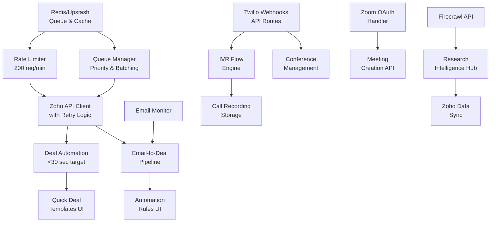

# P0 Technical Dependencies & Infrastructure Requirements

## Dependency Graph



## Critical Path Analysis

### Phase 1: Infrastructure (Days 1-3)
**Must Complete First - Blocks Everything**

1. **Redis Setup** (Day 1)
   - Blocks: All queue functionality
   - Risk: High - No fallback without Redis
   - Mitigation: In-memory queue fallback

2. **Rate Limiter** (Day 2)
   - Blocks: All Zoho operations
   - Risk: Critical - API lockout possible
   - Mitigation: Conservative limits (200/min vs 250/min)

3. **Queue Manager** (Day 3)
   - Blocks: Deal automation, batch operations
   - Risk: Medium - Performance degradation
   - Mitigation: Priority queues, smart batching

### Phase 2: Core Features (Days 4-10)
**Can Run in Parallel**

**Track A: Zoho Automation**
- Deal Automation (Days 4-5)
- Email Pipeline (Days 6-7)

**Track B: Communication APIs**
- Twilio Backend (Days 8-9)
- Zoom OAuth (Day 10)

### Phase 3: UI/UX (Days 11-15)
**Depends on Backend Completion**

- Firecrawl Redesign (Days 11-12)
- Integration Testing (Days 13-14)
- Production Deploy (Day 15)

## Technical Stack Requirements

### Infrastructure Services

#### 1. Redis (Upstash)
```typescript
// Configuration
UPSTASH_REDIS_REST_URL=https://xxx.upstash.io
UPSTASH_REDIS_REST_TOKEN=xxx

// Features Needed
- Sorted Sets (for priority queues)
- Pub/Sub (for real-time updates)
- TTL support (for caching)
- Atomic operations (for rate limiting)
```

#### 2. Supabase Edge Functions
```typescript
// Required Functions
- /zoho-queue-processor (cron: */1 * * * *)
- /email-monitor (cron: */5 * * * *)
- /twilio-webhook-handler (HTTP)
- /zoom-oauth-callback (HTTP)
```

#### 3. Storage Requirements
```typescript
// Supabase Storage Buckets
- call-recordings (public: false)
- email-attachments (public: false)
- deal-documents (public: false)
```

### API Integrations

#### 1. Zoho CRM API v2
```typescript
// Endpoints Used
POST /crm/v2/Deals
GET /crm/v2/Deals/search
PUT /crm/v2/Deals/{id}
POST /crm/v2/Contacts
POST /crm/v2/Tasks

// Rate Limits
- 250 calls/minute (use 200 for safety)
- 25,000 calls/day
- Batch operations: 100 records max
```

#### 2. Twilio API
```typescript
// Services Required
- Programmable Voice
- Programmable SMS
- Studio (for visual IVR)
- Functions (for serverless handlers)

// Webhooks Needed
POST /api/twilio/voice/status
POST /api/twilio/sms/status
POST /api/twilio/recording/complete
```

#### 3. Zoom API
```typescript
// OAuth Scopes Required
- meeting:write
- meeting:read
- user:read

// Endpoints
POST /users/me/meetings
GET /meetings/{meetingId}
DELETE /meetings/{meetingId}
```

### Database Schema Updates

```sql
-- Queue Management
CREATE TABLE IF NOT EXISTS api_queue (
    id UUID PRIMARY KEY DEFAULT gen_random_uuid(),
    api_name TEXT NOT NULL,
    endpoint TEXT NOT NULL,
    method TEXT NOT NULL,
    payload JSONB,
    priority INTEGER DEFAULT 5,
    status TEXT DEFAULT 'pending',
    attempts INTEGER DEFAULT 0,
    max_attempts INTEGER DEFAULT 3,
    error TEXT,
    created_at TIMESTAMP WITH TIME ZONE DEFAULT NOW(),
    processed_at TIMESTAMP WITH TIME ZONE
);

-- Deal Automation Templates
CREATE TABLE IF NOT EXISTS deal_templates (
    id UUID PRIMARY KEY DEFAULT gen_random_uuid(),
    name TEXT NOT NULL,
    icon TEXT,
    fields JSONB NOT NULL,
    category TEXT,
    usage_count INTEGER DEFAULT 0,
    created_at TIMESTAMP WITH TIME ZONE DEFAULT NOW()
);

-- Email Rules
CREATE TABLE IF NOT EXISTS email_automation_rules (
    id UUID PRIMARY KEY DEFAULT gen_random_uuid(),
    name TEXT NOT NULL,
    conditions JSONB NOT NULL,
    actions JSONB NOT NULL,
    priority INTEGER DEFAULT 5,
    is_active BOOLEAN DEFAULT true,
    created_at TIMESTAMP WITH TIME ZONE DEFAULT NOW()
);
```

### Performance Requirements

#### Response Times
- Deal Creation: <30 seconds total
  - Email parsing: <5 seconds
  - AI extraction: <10 seconds
  - Zoho API call: <10 seconds
  - UI feedback: <5 seconds

#### Throughput
- Zoho API: 200 requests/minute sustained
- Email processing: 100 emails/minute
- SMS sending: 10 messages/second
- IVR concurrent calls: 50

#### Reliability
- Queue persistence: 99.99%
- API availability: 99.9%
- Data consistency: ACID compliant
- Failover time: <30 seconds

### Security Requirements

#### API Keys Management
```typescript
// Encryption at rest
- All API keys in Supabase vault
- Environment-specific keys
- Rotation every 90 days

// Access Control
- Service accounts only
- IP whitelisting where supported
- OAuth 2.0 for user-facing APIs
```

#### Data Protection
- PII encryption in transit and at rest
- Call recordings encrypted
- Email content sanitization
- GDPR compliance for EU data

### Monitoring & Observability

#### Metrics to Track
```typescript
interface SystemMetrics {
  // API Performance
  apiLatency: HistogramMetric
  apiErrors: CounterMetric
  rateLimitHits: CounterMetric
  
  // Queue Health
  queueDepth: GaugeMetric
  processingTime: HistogramMetric
  failedJobs: CounterMetric
  
  // Business Metrics
  dealsCreated: CounterMetric
  automationTriggers: CounterMetric
  userActions: CounterMetric
}
```

#### Alerting Thresholds
- API response time > 5 seconds
- Queue depth > 1000 items
- Error rate > 5%
- Rate limit usage > 80%

### Development Environment Setup

```bash
# Required Tools
- Node.js 18+
- Redis CLI
- ngrok (for webhook testing)
- Postman (for API testing)

# Local Services
docker run -d -p 6379:6379 redis:alpine
npm install -g @upstash/cli
npm install -g vercel

# Environment Files
.env.local (development)
.env.staging (testing)
.env.production (live)
```

### Testing Requirements

#### Unit Tests
- Queue manager logic
- Rate limiter accuracy
- Deal automation rules
- Email parsing accuracy

#### Integration Tests
- Zoho API with rate limiting
- Twilio webhook handling
- Zoom OAuth flow
- End-to-end workflows

#### Load Tests
- 200 concurrent Zoho requests
- 1000 queued operations
- 50 concurrent phone calls
- 100 simultaneous users

### Rollback Procedures

1. **Feature Flags**
   ```typescript
   const features = {
     dealAutomation: process.env.ENABLE_DEAL_AUTOMATION === 'true',
     emailPipeline: process.env.ENABLE_EMAIL_PIPELINE === 'true',
     twilioIntegration: process.env.ENABLE_TWILIO === 'true',
     zoomIntegration: process.env.ENABLE_ZOOM === 'true'
   }
   ```

2. **Database Migrations**
   - All migrations reversible
   - Backup before deployment
   - Test rollback procedures

3. **API Fallbacks**
   - Manual deal creation UI
   - Direct Zoho access
   - Phone number forwarding
   - Calendar invite emails

## Risk Matrix

| Risk | Probability | Impact | Mitigation |
|------|------------|--------|------------|
| Redis Outage | Low | High | In-memory queue, Upstash HA |
| Zoho Rate Limit | High | Critical | Queue system, caching, monitoring |
| Twilio Downtime | Low | Medium | Fallback numbers, status page |
| Zoom OAuth Failure | Medium | Low | Refresh logic, manual links |
| Queue Overflow | Medium | High | Priority system, auto-scaling |

## Go/No-Go Criteria

### Week 1 Checkpoints
- [ ] Redis connected and tested
- [ ] Rate limiter preventing API lockouts
- [ ] Deal creation under 30 seconds
- [ ] Queue processing operational

### Week 2 Checkpoints
- [ ] Email pipeline catching all test cases
- [ ] Twilio webhooks receiving calls
- [ ] Zoom meetings created successfully
- [ ] All integrations error-free for 24 hours

### Week 3 Checkpoints
- [ ] Load tests passing all thresholds
- [ ] UI responsive under load
- [ ] Monitoring dashboards operational
- [ ] Rollback procedures tested

## Conclusion

This technical dependency map ensures all P0 features are built on a solid foundation. The critical path prioritizes infrastructure (Redis) and rate limiting to prevent system failures. Parallel development tracks maximize efficiency while maintaining quality.

Success depends on:
1. Early infrastructure deployment
2. Conservative rate limiting
3. Comprehensive testing
4. Clear rollback procedures
5. Real-time monitoring

With these dependencies properly managed, the 3-week timeline is achievable with acceptable risk.