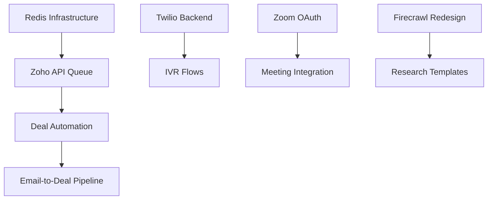

# EVA Platform P0 Implementation Plan
**Version**: 1.0  
**Created**: January 15, 2025  
**Coordinator**: Agent 6 - Implementation Coordinator

## Executive Summary

This plan coordinates the implementation of all P0 (Critical) priorities for the EVA platform. Based on analysis from 5 specialized agents and current codebase state, we have:

- **Total P0 Items**: 5 (4 pending, 1 completed)
- **Timeline**: 3 weeks total
- **Critical Dependencies**: Redis infrastructure, API rate limiting
- **Major Risk**: Zoho API limits affecting system performance

## Current P0 Status

### ✅ Completed
1. **Visual Workflow Designer** - Fully implemented at `/dashboard/workflows` with drag-and-drop functionality

### 🚧 In Progress
1. **Twilio Integration** - UI complete, needs backend API routes
2. **Zoom Integration** - Frontend complete, OAuth flow needs completion

### 📋 Not Started
1. **Deal Creation Automation** (<30 seconds)
2. **Zoho API Rate Limit Fix**
3. **Email-to-Deal Pipeline**
4. **Firecrawl Page Redesign**

## Week-by-Week Implementation Plan

### Week 1 (Jan 15-21): Critical Infrastructure & Quick Wins

#### Day 1-2: Redis Infrastructure Setup
**Owner**: Backend Team  
**Dependencies**: None  
**Tasks**:
1. Set up Upstash Redis instance
2. Configure connection in Supabase Edge Functions
3. Implement queue manager base class
4. Deploy and test basic queue operations

**Implementation Files**:
```typescript
// lib/infrastructure/redis-client.ts
// lib/queue/queue-manager.ts
// lib/queue/rate-limiter.ts
```

#### Day 2-3: Zoho API Rate Limiting Solution
**Owner**: Integration Team  
**Dependencies**: Redis infrastructure  
**Tasks**:
1. Implement ZohoAPIQueue with rate limiting
2. Add request batching logic
3. Create caching layer for common requests
4. Implement retry with exponential backoff

**Key Components**:
- Request queue with 200/min limit (buffer from 250)
- Smart batching for similar requests
- 5-minute cache for frequently accessed data
- Circuit breaker pattern for API failures

#### Day 4-5: Deal Creation Automation
**Owner**: AI/Automation Team  
**Dependencies**: Zoho API queue  
**Tasks**:
1. Create DealAutomationAgent
2. Implement quick templates UI
3. Add AI extraction for email->deal
4. Create <30 second workflow

**Performance Targets**:
- Email parsing: <5 seconds
- Deal creation: <10 seconds
- Total workflow: <30 seconds

### Week 2 (Jan 22-28): Core Automations & Integrations

#### Day 6-7: Email-to-Deal Pipeline
**Owner**: AI Team  
**Dependencies**: Deal automation agent  
**Tasks**:
1. Implement EmailDealParser
2. Create automation rules engine
3. Add email monitoring hooks
4. Test with real email scenarios

**Automation Rules**:
- Client inquiry → Deal creation
- Resume attachment → Candidate + matching
- Meeting request → Calendar integration

#### Day 8-9: Twilio Backend Implementation
**Owner**: Backend Team  
**Dependencies**: None  
**Tasks**:
1. Create API routes for Twilio webhooks
2. Implement IVR flow executor
3. Add conference call management
4. Set up recording storage

**API Routes Needed**:
```
/api/twilio/webhooks/voice
/api/twilio/webhooks/sms
/api/twilio/ivr/[flowId]
/api/twilio/conference/[action]
```

#### Day 10: Zoom OAuth Completion
**Owner**: Integration Team  
**Dependencies**: None  
**Tasks**:
1. Complete OAuth callback handler
2. Implement token refresh logic
3. Add meeting creation API
4. Test full OAuth flow

### Week 3 (Jan 29-Feb 4): UI Polish & Testing

#### Day 11-12: Firecrawl Redesign
**Owner**: Frontend Team  
**Dependencies**: None  
**Tasks**:
1. Create Research Intelligence Hub UI
2. Implement research wizards
3. Add quick research templates
4. Integrate with existing Firecrawl backend

**New Components**:
- ResearchHub page layout
- QuickResearchCards
- ResearchWizard flow
- ResultsViewer with Zoho sync

#### Day 13-14: Integration Testing
**Owner**: QA Team  
**Dependencies**: All P0 features  
**Tasks**:
1. End-to-end workflow testing
2. Performance benchmarking
3. Load testing with rate limits
4. User acceptance testing

#### Day 15: Production Deployment
**Owner**: DevOps Team  
**Dependencies**: All testing complete  
**Tasks**:
1. Deploy Redis infrastructure
2. Update environment variables
3. Deploy all API routes
4. Monitor initial usage

## Infrastructure Requirements

### New Services Needed
1. **Redis (Upstash)**
   - Purpose: Queue management, rate limiting, caching
   - Cost: ~$10-50/month based on usage
   - Setup: 2 hours

2. **Background Job Processing**
   - Purpose: Async task execution
   - Implementation: Supabase Edge Functions with cron
   - Cost: Included in Supabase

### Environment Variables Required
```env
# Redis
UPSTASH_REDIS_URL=
UPSTASH_REDIS_TOKEN=

# Twilio (already configured)
TWILIO_ACCOUNT_SID=
TWILIO_AUTH_TOKEN=
TWILIO_PHONE_NUMBER=

# Zoom
ZOOM_CLIENT_ID=
ZOOM_CLIENT_SECRET=
ZOOM_REDIRECT_URI=
```

## Risk Mitigation

### Risk 1: Zoho API Rate Limits
**Probability**: High  
**Impact**: Critical  
**Mitigation**:
- Implement queue system before any other Zoho features
- Add comprehensive caching
- Monitor API usage in real-time
- Have manual fallback procedures

### Risk 2: Redis Infrastructure Failure
**Probability**: Low  
**Impact**: High  
**Mitigation**:
- Use Upstash with automatic failover
- Implement in-memory fallback queue
- Add circuit breakers
- Monitor queue depth

### Risk 3: Integration Complexity
**Probability**: Medium  
**Impact**: Medium  
**Mitigation**:
- Test each integration in isolation
- Create comprehensive error handling
- Add detailed logging
- Have rollback procedures

## Success Metrics

### Technical Metrics
- ✅ Deal creation time: <30 seconds
- ✅ API response time: <500ms average
- ✅ Queue processing: <5 second delay
- ✅ System uptime: 99.9%

### Business Metrics
- User adoption of automation: >80%
- Time saved per recruiter: 2+ hours/day
- Missed opportunities: <5%
- Customer satisfaction: >4.5/5

## Dependencies Between P0 Items



## Resource Allocation

### Team Assignments
- **Backend Team** (2 devs): Redis, Twilio API, Zoom OAuth
- **Frontend Team** (2 devs): Deal UI, Firecrawl redesign
- **Integration Team** (1 dev): Zoho queue, email pipeline
- **AI Team** (1 dev): Deal automation, email parsing
- **QA Team** (1 tester): End-to-end testing

### Time Estimates
- Total developer hours: ~320 hours
- Calendar time: 3 weeks
- Buffer for issues: 20%

## Implementation Checklist

### Week 1
- [ ] Redis infrastructure deployed
- [ ] Zoho API queue implemented
- [ ] Rate limiting tested
- [ ] Deal automation agent created
- [ ] Quick templates UI complete
- [ ] <30 second deal creation achieved

### Week 2
- [ ] Email parser implemented
- [ ] Automation rules engine deployed
- [ ] Twilio API routes created
- [ ] IVR flow executor working
- [ ] Zoom OAuth flow complete
- [ ] Meeting creation tested

### Week 3
- [ ] Research Hub UI complete
- [ ] All integrations tested
- [ ] Performance benchmarks met
- [ ] Load testing passed
- [ ] Production deployment successful
- [ ] Monitoring in place

## Post-Implementation

### Monitoring Plan
1. API rate limit dashboard
2. Queue depth monitoring
3. Error rate tracking
4. Performance metrics
5. User adoption analytics

### Support Plan
1. Documentation for all new features
2. Video tutorials for workflows
3. In-app guidance
4. Support ticket priorities

## Conclusion

This implementation plan provides a structured approach to completing all P0 priorities within 3 weeks. The critical path focuses on infrastructure (Redis) and rate limiting first, enabling all subsequent features to build on a solid foundation.

Key success factors:
1. Early Redis deployment
2. Comprehensive Zoho API queue
3. Parallel development tracks
4. Continuous testing
5. Clear success metrics

By following this plan, we'll deliver all critical demo feedback items while maintaining system stability and performance.